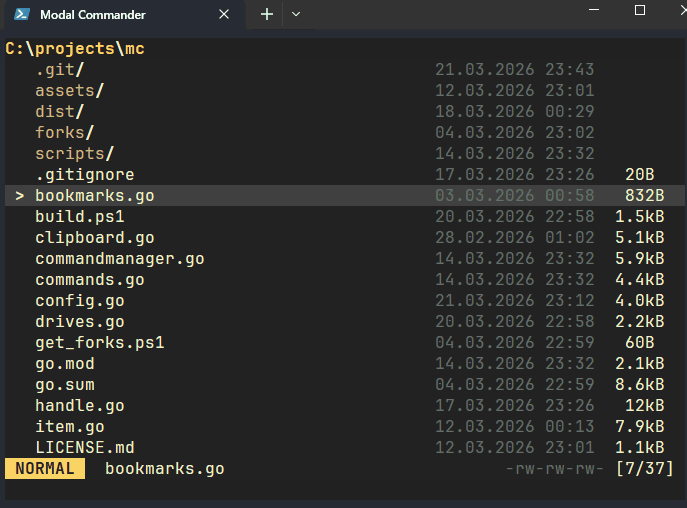
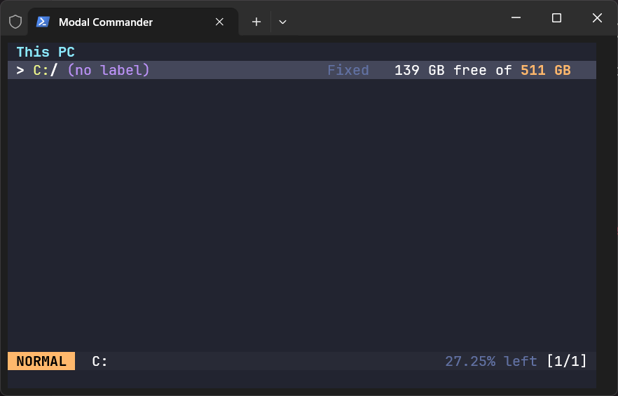
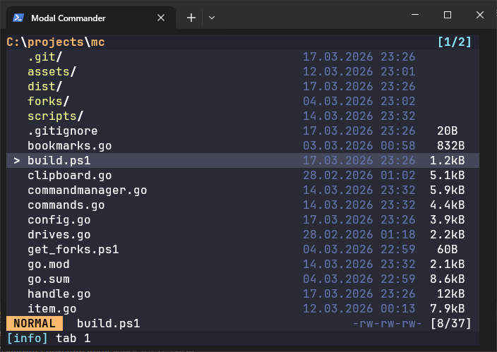
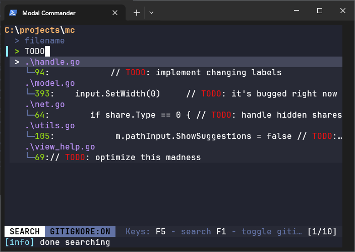
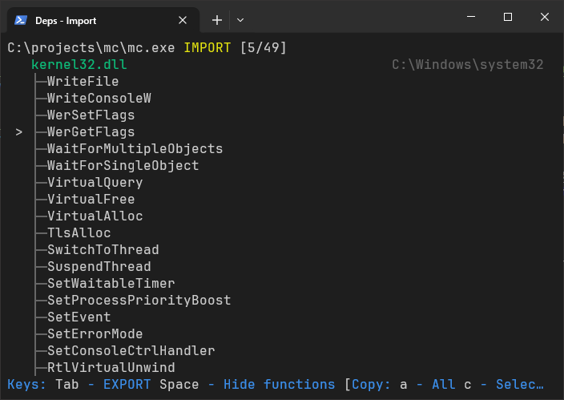
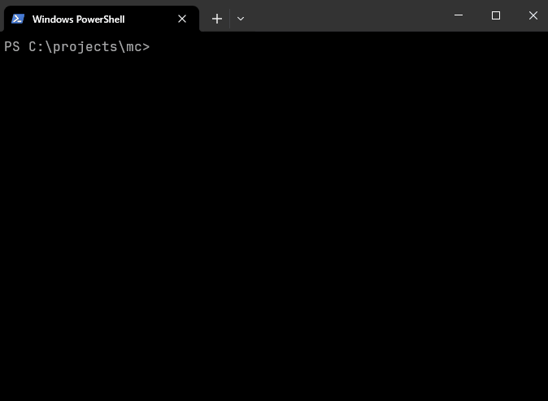

# Modal Commander

Modal Commander (mc) is a TUI file manager for Windows (though it might be ported to other platforms in the future). It's heavily inspired by Yazi, Helix, and Total Commander. 

## Version 1.1

Themes have been added.



The theme can be set in Go mode (`g` -> `T`). The config can be saved by pressing `g` -> `C`. Alternatively, the theme can be set by editing `$env:APPDATA\mc\config.toml`:

```toml
theme = "tokyonight"
```

## Demo







## How to install

Currently, `mc` uses [bat](https://github.com/sharkdp/bat) for viewing files, and [helix](https://github.com/helix-editor/helix) for editing. `bat` requires `less` to work and I strongly recommend using the one that comes with `git`. 

I also recommend using [Windows Terminal](https://github.com/microsoft/terminal) because it's the only terminal emulator, that I found, that makes the mouse work properly on Windows 10. It also looks kinda good if you install https://www.nerdfonts.com/font-downloads specifically `JetBrainsMonoNL Nerd Font`. 

Here is how you can configure your powershell to `cd` to the directory when you exit: https://github.com/Fiend3d/mc/tree/master/scripts you can also find there `t.bat` that makes launching Windows Terminal a lot easier, because by default it doesn't open the current directory and typing just `t` is convenient. 

## How to use

Pressing `F1` shows documentation that can be filtered by pressing `f`. I tried to make `mc` as intuitive as possible, and for the most part, everything is accessible with the mouse.

### Normal Mode

The main mode of the program, from which most other modes can be accessed.

**q** - Quit, returning the current directory.<br/>
**Q** - Quit without returning anything.<br/>
**space** - Select.<br/>
**Ctrl+a** - Select all.<br/>
**Ctrl+d** - Deselect all.<br/>
**Ctrl+r** - Toggle selection (invert all).<br/>
**y** - Copy selected items. This uses standard Windows file paths, so you can paste them directly into Explorer.<br/>
**x** - Cut.<br/>
**d** - Delete PERMANENTLY. It will prompt for confirmation.<br/>
**r** - Rename. When multiple items are selected, an editor opens so you can edit all the names at once.<br/>
**p** - Paste.<br/>
**P** - Paste with override. Prompts for confirmation if there's a collision.<br/>
**u** - Undo.<br/>
**U** - Redo.<br/>
**t** - Copy current tab.<br/>
**Ctrl+w** - Close current tab.<br/>
**T** - Restore closed tab.<br/>
**Ctrl+t, Ctrl+n** - Open selected directory in a new tab.<br/>
**]** - Next tab.<br/>
**[** - Previous tab.<br/>
**1-0** - Select tabs 1 to 10 (0 is tab 10).<br/>
**Ctrl+b**  - Go back in history.<br/>
**Ctrl+f** - Go forward in history.<br/>
**F5** - Update.<br/>
<br/>
**B** - Bookmark the directory.<br/>
**b** - Browse bookmarks.<br/>

### Jump Mode

Can be entered by pressing `tab` in the normal mode. Jump mode is to mimic Explorer's behavior when pressing buttons to jump to the needed item. 

### Visual Mode

Can be entered by pressing `v`. It's for range selecting. 

### Filter Mode

Entered by pressing `f` in the normal mode. Current tab can be filtered. 

### Copy Mode

Entered by pressing `c`. Capital letters convert slashes from `\` to `/`. "Copy the filenames as arguments" means it can be used as arguments for terminal commands (if path has spaces it will be quoted).

**c/C** - Copy the file path/Forward.<br/>
**d/D** - Copy the directory/Forward.<br/>
**f** - Copy the filename.<br/>
**n** - Copy the filename without extension.<br/>
**a/A** - Copy the file paths as arguments/Forward.<br/>
**s** - Copy the filenames as arguments.<br/>
**q/Q** - Copy the file paths as array/Forward.<br/>
**w** - Copy the filenames as array.<br/>

### Sort Mode

Entered by pressing `,` (comma). Capital letters sort in reverse.

**m/M** - Sort by modified time.<br/>
**a/A** - Sort alphabetically.<br/>
**n/N** - Sort normally.<br/>
**e/E** - Sort by extension.<br/>
**s/S** - Sort by size.<br/>
**r** - Sort randomly.<br/>

### Create Mode

Entered by pressing `a`. If your name ends with a slash it's a directory.

### Message Mode

Entered by pressing `` ` `` (backtick). The message history can be viewed here.

### Search Mode

Press `s` to enter search mode. Use `tab` to cycle through focus. By default, search respects `.gitignore`, but you can disable this by pressing `F1` while in search mode.

Press `F3` on a line to open it with `bat`; it will jump directly to that line. Press `n` to jump to the next match (or `N` to go backwards). Press `h` to hide all matched lines.

`F5` or `Enter` while focussing a text input - start searching.

### Shell Mode

Press `:` to enter shell mode. You can hide and show TUI by pressing `Ctrl+h` to see the result of a command. `#sl` - is a macro that is converted to a list of selected items for a command. 

**Ctrl+b** - Back in history.<br/>
**Ctrl+f** - Forward in history.<br/>

### Go Mode

Go mode is just a menu.

**g** - Enter Path mode.<br/>
**t** - Browse tabs.<br/>
**T** - Set theme.<br/>
**c** - Open the settings directory. You can also find and delete bookmarks there, for example.<br/>
**C** - Save settings to config.toml for editing.<br/>
**s** - Calculate size for the selected directories.<br/>

### Path Mode

Press `gg` to enter path mode.

**ctrl+u** - Clear all left of cursor.<br/>
**ctrl+k** - Clear all right of cursor.<br/>
**ctrl+w** - Delete a word.<br/>
**tab** - Autocomplete.<br/>
**up/down** - Next/previous autocomplete.<br/>
**ctrl+e** - Expand environment variables.<br/>
**ctrl+n** - Open the path in a new tab.<br/>

### Tools

`F2-F4`, `F6-F12` - tools. They can be configured in `config.toml`. The default config can be saved by pressing `gC` (`g` and then `C`, and then `gc` to find it).

**F2** - Dependency walker. [deps](https://github.com/Fiend3d/deps) by default, but everything is configurable.<br/>
**F3** - Viewer.<br/>
**F4** - Editor.<br/>
**F6** - Open the directory in Explorer.<br/>
**F7** - Open the files in VS Code.<br/>
**F8** - Open the directory in VS Code.<br/>
**F9-F12** - Unassigned (configurable).<br/>

## How to Build

Because I fixed a few issues in [github.com/charmbracelet/bubbles](https://github.com/charmbracelet/bubbles), you'll need to get my fork first.

You can do this using:

```powershell
.\get_forks.ps1
```

If that doesn't work, you may need to enable PowerShell scripts first:

```powershell
Set-ExecutionPolicy -ExecutionPolicy RemoteSigned -Scope CurrentUser
```

Then simply run:


```powershell
.\build.ps1
```
