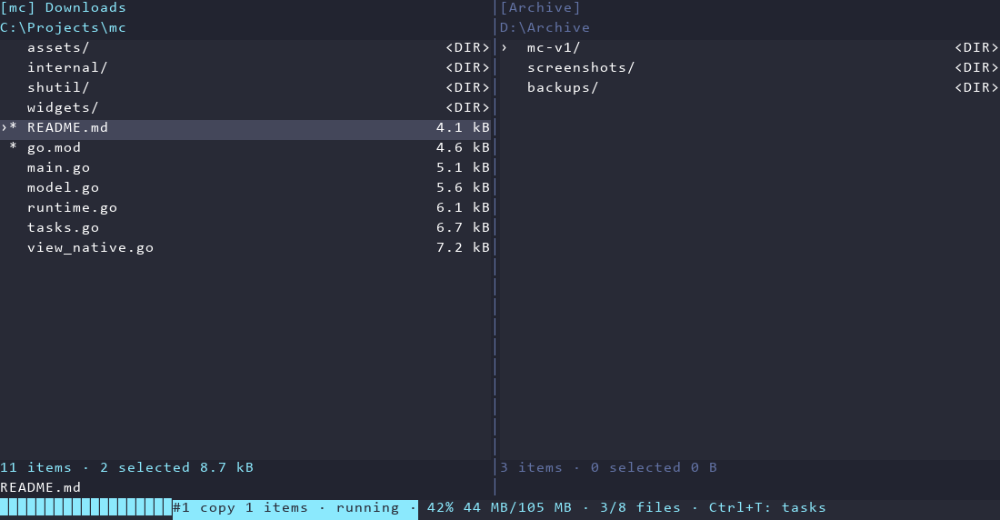
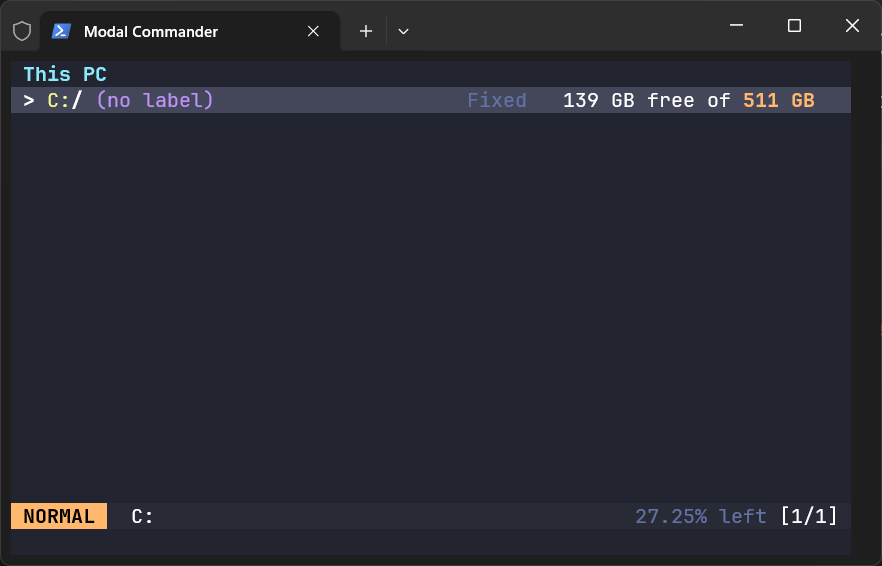
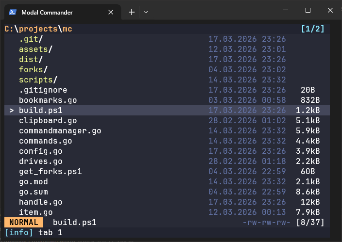
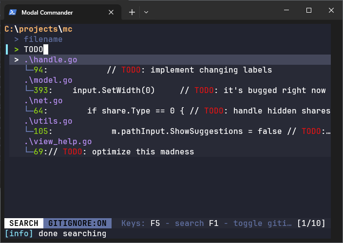
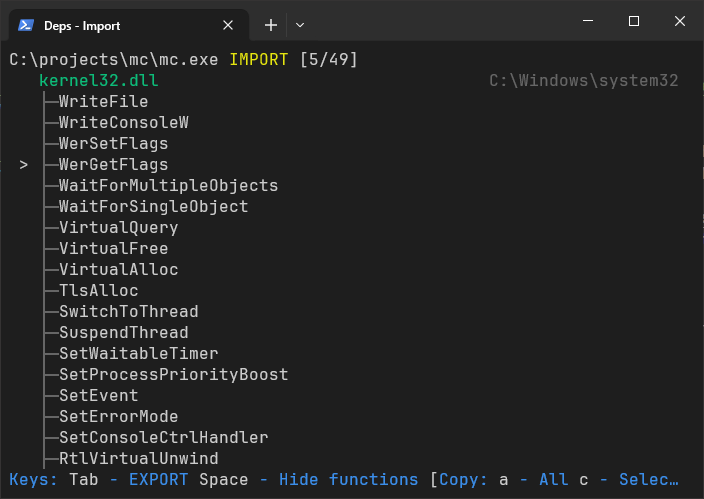
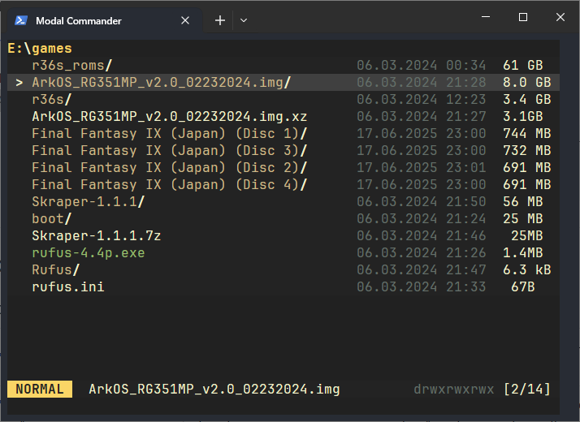
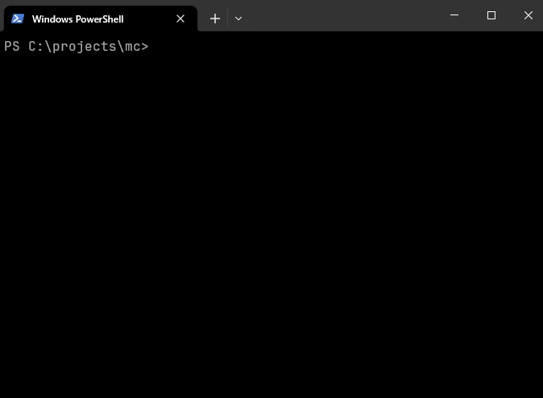

# Modal Commander

**Two panes. Fast file work. Git changes at a glance.**

Modal Commander (`mc`) is a keyboard-driven file manager for the Windows terminal, inspired by Yazi, Helix and Total Commander. Browse independent panes, copy and move files without stopping your work, and inspect changes without leaving your file manager.



## Why mc?

- **Two panes, your workflow.** Independent tabs, history, selections, filters and sorting; move or copy tabs between panes.
- **Keep browsing during transfers.** Background tasks show progress, support cancellation, and let you undo completed reversible work.
- **Works with Explorer.** Copy and cut files through the Windows clipboard, then paste in either application.
- **Find the right line.** Search filenames and file contents, respect `.gitignore`, and jump from a match to your viewer.
- **See what changed.** Vibe mode presents a live Git change tree rooted at the repository; Compare aligns two files side by side with inline differences.
- **Make it yours.** Eight themes, configurable function-key tools, bookmarks and a PowerShell command prompt.

## Quick start

1. Download a Windows archive from [GitHub Releases](https://github.com/Fiend3d/mc/releases).
2. Extract it and run `mc.exe` from your terminal. No Go installation is needed for a release binary.
3. Optionally add the extracted directory to `PATH` to run `mc` from anywhere.

Open two directories side by side:

```powershell
mc.exe C:\projects C:\downloads
```

With no directory arguments, the left pane opens your working directory. The right pane restores its saved tabs, or starts empty if none are saved. A second directory argument overrides restoration; extra directories become left-pane tabs. Only right-pane tabs persist between sessions.

### Your first session

Keys are case-sensitive: `Y` means Shift+Y. Sequences such as `gg` mean press the keys in order.

| Key | Action |
|---|---|
| Arrows or `h/j/k/l`, `Enter` | Navigate and open items |
| `Tab` | Switch panes |
| `Space` / `Insert` | Select an item and advance |
| `Y` / `X` | Copy / move selected items to the opposite pane |
| `y` / `x`, then `p` | Copy / cut, then paste through the Windows clipboard |
| `w` | View background tasks |
| `s` / `f` | Search filenames and contents / filter the current tab |
| `v` | Browse the live Git change tree (inside a repository) |
| `Shift+D` | Compare the file under each pane's cursor |
| `F3` / `F4` | Open the configured viewer / editor |
| `gg` / `Ctrl+J` | Enter a path / jump to an item by typing |
| `F1` | Read help; press `F` there to filter it |
| `q` | Quit |

Normal transfers choose unique names on collisions. `P` requests overwrite with confirmation. **Delete is permanent; overwrites are not undoable.** Other completed reversible work, including partial transfers, can be undone.

Want your shell to follow the directory you exit from? Install the optional [PowerShell `cd` wrapper](scripts/readme.md). The focused pane supplies the returned directory; `Q` exits without returning one.

### Requirements and optional tools

The file manager runs on **Windows**. External tools are optional and needed only for the features that invoke them:

| Tool | Used for |
|---|---|
| `git` on `PATH` | Git status, tally lists and Vibe mode |
| `koneko` | Default F3 viewer; line targeting in Search and Vibe |
| `hx` (Helix) | Default F4 editor |
| `code` (VS Code) | Default F7/F8 tools |
| `deps` | Default F2 dependency viewer |
| `lazygit` on `PATH` | Default F9 Git interface |

All F-key tools are configurable. `bat` with `less` can be configured as an alternative viewer. For the intended mouse and icon experience, use Windows Terminal and a Nerd Font such as JetBrainsMonoNL Nerd Font.

## Reference

<details>
<summary>Two-pane workflows, selections and background tasks</summary>

### Panes and tasks

mc now uses [catatui](https://github.com/Fiend3d/catatui), with two independent panes and background file tasks. Each pane has its own tabs, history, selection, filter and sorting. Existing themes and F-key tool configuration are retained.

- `Tab` switches panes. Click a pane to focus it; click a pane tab to switch directly.
- `Ctrl+Left` / `Ctrl+Right` move the current tab to that pane and follow it; `Shift+Left` / `Shift+Right` copy it there and keep the focus.
- A pane may hold no tabs at all: `Ctrl+W` closes the last one and a move can empty the source. The empty pane keeps its half of the screen; `T` restores the last closed tab, `gg` opens a path, `b` picks a bookmark, and `Shift+Left`/`Shift+Right` copies one in from the other side. Keys that need a current directory do nothing there. Quitting from an empty pane returns no directory.
- `Space` / `Insert` toggles an item and advances; select-all, invert and clear remain available. Visual mode has been removed.
- `Shift+Up/Down` extends or shrinks a range; `Shift+Home/End` extends to the first or last item; `Ctrl+click` extends to the clicked item. Earlier selections are preserved. Ordinary navigation starts a new range anchor. `Shift+click` also works in terminals that forward it, but Windows Terminal reserves it for terminal text selection.
- `Y` copies and `X` moves selected items to the opposite pane. Enter confirms the editable destination. Existing `y/x/p/P` clipboard operations are unchanged.
- `w` opens tasks; `c` cancels the highlighted task and Escape returns to browsing. File operations run sequentially while browsing remains available. Progress shows bytes and file counts, with scanning shown before totals are known.
- `Ctrl+J` enters Jump mode. `Ctrl+N` still opens a directory in a new tab.
- `Shift+D` opens Compare mode for the file under each pane's cursor, ignoring marked selections.
- Inside a git work tree each entry carries its status in a column before the name (`M` modified, `A` added, `D` deleted, `R` renamed, `U` conflicted, `?` untracked, ignored entries dimmed), and a directory takes the most severe state of anything inside it. The path row says where the repository is: the component the work tree starts at is highlighted — coloured while anything is uncommitted, green once nothing is — and the branch with its `↑↓` and `+~?` tallies sits at the end of the same row, stepping aside when the pane is too narrow for both. The tallies are clickable: point at `~10` to light it up and click for the list of exactly those files anywhere in the repository, where `enter` jumps to one, `F2`-`F12` run their tools on it and `Esc` closes it; `gm`, `gu` and `ga` open the same three lists from the keyboard. It needs `git` on `PATH`; elsewhere mc never even spawns it. Set `git = false` in `config.toml` to turn it off.

Normal transfers choose unique names on collisions; `P` explicitly requests overwrite and confirms collisions. Cancellation retains completed files and removes unfinished temporary copies. Completed reversible work can be undone, including partial tasks. Delete is permanent; overwrites are not undoable. Undo/redo refuses conflicting or changed paths. Reparse points are reported as unsupported for transfers/deletion.

The right pane's tabs are saved to `$env:APPDATA\mc\tabs.list` on exit. The left pane and task history are not persisted.

Set a theme with `g` -> `T`, save with `g` -> `C`, or edit `$env:APPDATA\mc\config.toml`.

### Normal Mode

The main mode of the program, from which most other modes can be accessed.

**q** - Quit, returning the current directory.<br/>
**Q** - Quit without returning anything.<br/>
**space** - Select.<br/>
**Shift+Up / Shift+Down** - Extend or shrink the selection range.<br/>
**Shift+Home / Shift+End** - Extend the selection range to the first or last item.<br/>
**Ctrl+click** - Extend the selection range to the clicked item.<br/>
**Ctrl+a** - Select all.<br/>
**Ctrl+d** - Deselect all.<br/>
**Ctrl+r** - Toggle selection (invert all).<br/>
**y** - Copy selected items. This uses standard Windows file paths, so you can paste them directly into Explorer.<br/>
**x** - Cut.<br/>
**d** - Delete PERMANENTLY. It will prompt for confirmation.<br/>
**r** - Rename. When multiple items are selected, an editor opens so you can edit all the names at once.<br/>
**p** - Paste.<br/>
**P** - Paste with override. Prompts for confirmation if there's a collision.<br/>
**u** - Undo.<br/>
**U** - Redo.<br/>
**t** - Copy current tab.<br/>
**Ctrl+w** - Close current tab.<br/>
**T** - Restore closed tab.<br/>
**Ctrl+n** - Open selected directory in a new tab.<br/>
**]** - Next tab.<br/>
**[** - Previous tab.<br/>
**1-0** - Select tabs 1 to 10 (0 is tab 10).<br/>
**Ctrl+b**  - Go back in history.<br/>
**Ctrl+f** - Go forward in history.<br/>
Directories update automatically from filesystem notifications, with periodic checks for missed changes and clipboard updates. Refresh keeps the focused file and scroll position when those items still exist. **F5** forces an immediate update.<br/>
<br/>
**B** - Bookmark the directory.<br/>
**b** - Browse bookmarks.<br/>

### Jump Mode

Can be entered by pressing `Ctrl+J` in the normal mode. Jump mode is to mimic Explorer's behavior when pressing buttons to jump to the needed item.

</details>

<details>
<summary>Compare: side-by-side file differences</summary>

### Compare mode

Press `Shift+D` in Normal mode to compare the files under the left and right pane cursors. The read-only Differences view aligns lines side by side, with red/green changes and inline highlights. Marked selections are ignored. Both cursors must point to files.

Use `n`/`p` for the next/previous difference, `j`/`k` or arrows and the mouse wheel to scroll, `PgUp`/`PgDn` to page, `Home`/`End` for the beginning/end, and `h`/`l` or left/right to pan long lines. `F5` reloads the same two paths; `w` opens Tasks. `Esc` or `q` returns to the panes with their state preserved.

UTF-8 text (including BOM) up to 5 MiB per file gets detailed comparison. Whitespace, line endings and missing final newlines remain significant. Binary files, unsupported encodings, larger files and comparisons exceeding the work or 100,000 line-break limit get a streamed identical/different summary. This is a snapshot; refresh with `F5` after external edits.

</details>

<details>
<summary>Vibe: a live, repository-root Git change tree</summary>

### Vibe Mode

Press **v** in Normal mode anywhere inside a Git working tree. Vibe opens a live tree rooted at the **Git repository root**, even when your pane is in a subdirectory:

```text
repository/
  src/
    components/
      [M] button.go  +1 −1
        @@ -12,3 +12,3 @@
             12    12   context
             13       -old line
                   13 +new line
             14    14   context
```

The tree contains only changed files and their parent directories. Files expand into diff hunks with three surrounding context lines. Added lines are green, deleted lines red; the two line-number columns refer to the baseline and current file. Folders, files and hunks start expanded.

Vibe compares the working files against **HEAD**, combining staged and unstaged changes. Edits that cancel out relative to HEAD have no net diff. Untracked files appear individually as additions; ignored files are excluded. Before the first commit, the baseline is empty. Git must be on PATH and `git = true` enabled in config.toml.

| Key | Action |
|---|---|
| `j/k`, Up/Down | Move through visible rows |
| Mouse wheel | Scroll the view without moving the selection |
| `PgUp/PgDn`, `Home/End` | Page or jump to the first/last row |
| `h/Left` | Collapse a branch, or select its parent |
| `l/Right` | Expand a branch, or enter it |
| `Space` | Toggle expansion |
| `e` / `c` | Expand all / collapse all branches |
| `[` / `]` | Previous/next hunk; expand its ancestors |
| `Enter/F3` | View the selected file/change; Enter toggles directories |
| `F5` | Refresh immediately |
| `w` | Toggle word wrap (on by default) |
| `Esc/q` | Return to the panes |

The repository root stays expanded. `c` collapses its descendants, leaving top-level files and folders visible.

Click selects a row. Double-click toggles a branch or views a line. F3 on a file or hunk opens its first change. Added and context lines open the current file; deleted lines open a temporary read-only copy of the displayed baseline. Renames retain the original path, so historical viewing also works for renamed and entirely deleted files. Koneko receives mc's theme and selects the requested line; historical copies disable its Git gutter. Custom F3 viewers are honored, with line targeting available for koneko. Temporary copies are removed after viewing or a launch failure.

**Automatic updates:** Vibe refreshes every two seconds while visible, including changes to files, the index, branch and HEAD. Refreshes run in the background; repeated requests coalesce. The tree preserves expansion, selection and scroll position where possible. If the selected row disappears, selection moves to a surviving parent. A refresh failure retains the previous tree and retries. Polling pauses during external viewing and refreshes immediately on return. F5 requests an immediate refresh.

Long tree labels and diff text wrap to the available width. Continuation lines retain the outer tree branches and belong to the same selectable row. Mouse hover highlights the entire row, including its wrapped lines. The mouse wheel scrolls screen lines without changing selection.

Press `w` to toggle wrapping; the footer shows its state. A scrollbar on the right shows your position and supports clicking and dragging, like the F1 help scrollbar.

Vibe is read-only. Binary, oversized, conflicted, symbolic-link, submodule and metadata-only changes appear as summaries. Text previews and historical viewing are limited to 5 MiB per file; patches are bounded at 32 MiB and displayed diff lines at 100,000 per refresh. Current files remain viewable from summary rows. Vibe complements the Git tally lists (files grouped by status) and Compare mode (two cursor files from the panes).

</details>

<details>
<summary>Search and filter</summary>

### Search Mode

Press `s` to search filenames and contents. `Tab` cycles focus. Search respects `.gitignore` by default (`F1` toggles it) and is case-insensitive (`F2` toggles it). `F5` or `Enter` while focusing a text input starts the search.

`F3` opens the selected match in the configured viewer, targeting its line when supported. `n` / `N` selects the next / previous match; `h` hides matched lines.

### Filter Mode

Entered by pressing `f` in the normal mode. Current tab can be filtered.

</details>

<details>
<summary>Copy paths, sorting, creation, shell and navigation modes</summary>

### Copy Mode

Entered by pressing `c`. Capital letters convert slashes from `\` to `/`. "Copy the filenames as arguments" means it can be used as arguments for terminal commands (if path has spaces it will be quoted).

**c/C** - Copy the file path/Forward.<br/>
**d/D** - Copy the directory/Forward.<br/>
**f** - Copy the filename.<br/>
**n** - Copy the filename without extension.<br/>
**a/A** - Copy the file paths as arguments/Forward.<br/>
**s** - Copy the filenames as arguments.<br/>
**q/Q** - Copy the file paths as array/Forward.<br/>
**w** - Copy the filenames as array.<br/>

### Sort Mode

Entered by pressing `,` (comma). Capital letters sort in reverse.

**m/M** - Sort by modified time.<br/>
**a/A** - Sort alphabetically.<br/>
**n/N** - Sort normally.<br/>
**e/E** - Sort by extension.<br/>
**s/S** - Sort by size.<br/>
**r** - Sort randomly.<br/>

### Create Mode

Entered by pressing `a`. If your name ends with a slash it's a directory.

### Message Mode

Entered by pressing `` ` `` (backtick). The message history can be viewed here.

### Shell Mode

Press `:` to enter shell mode. You can hide and show TUI by pressing `Ctrl+h` to see the result of a command. `#sl` - is a macro that is converted to a list of selected items for a command.

Press `;` in normal mode to rerun the last shell command without reopening shell mode. `#sl` expands against the current selection, so the same command can be applied to different items.

**Ctrl+b** - Back in history.<br/>
**Ctrl+f** - Forward in history.<br/>

### Go Mode

Go mode is just a menu.

**g** - Enter Path mode.<br/>
**t** - Browse tabs.<br/>
**T** - Set theme.<br/>
**c** - Open the settings directory. You can also find and delete bookmarks there, for example.<br/>
**C** - Save settings to config.toml for editing.<br/>
**s** - Calculate size for the selected directories. Runs as a background task alongside file operations; watch or cancel it with **w**.<br/>

### Path Mode

Press `gg` to enter path mode.

**ctrl+u** - Clear all left of cursor.<br/>
**ctrl+k** - Clear all right of cursor.<br/>
**ctrl+w** - Delete a word.<br/>
**tab** - Autocomplete.<br/>
**up/down** - Next/previous autocomplete.<br/>
**ctrl+e** - Expand environment variables.<br/>
**ctrl+n** - Open the path in a new tab.<br/>

</details>

<details>
<summary>Configuration, themes and F-key tools</summary>

### Configuration

Settings live in `$env:APPDATA\mc\config.toml`. Press `gT` to choose a theme, `gC` to save settings and `gc` to open the settings directory. Bookmarks and saved right-pane tabs live beside the config. Set `git = false` to disable Git integration.

Themes: dracula (default), autumn, base16, ferra, github, monokai, nord and tokyonight.

### Tools

`F2-F4`, `F6-F12` - tools. They can be configured in `config.toml`. The default config can be saved by pressing `gC` (`g` and then `C`, and then `gc` to find it).

**F2** - Dependency walker. [deps](https://github.com/Fiend3d/deps) by default, but everything is configurable.<br/>
**F3** - Viewer.<br/>
**F4** - Editor.<br/>
**F6** - Open the directory in Explorer.<br/>
**F7** - Open the files in VS Code.<br/>
**F8** - Open the directory in VS Code.<br/>
**F9** - Open lazygit in the current directory (requires `lazygit` on PATH, configurable).<br/>
**F10-F12** - Unassigned (configurable).<br/>

</details>

## Build from source

Requires Windows and Go 1.27.0. The released catatui dependency is fetched through the Go module proxy; no sibling checkout is needed.

```powershell
.\build.ps1
.\build.ps1 dist  # Build and package a release in dist/
.\build.ps1 icon  # Embed the icon (requires rsrc)
```

If that doesn't work, you may need to enable PowerShell scripts first:

```powershell
Set-ExecutionPolicy -ExecutionPolicy RemoteSigned -Scope CurrentUser
```

Validate changes with:

```powershell
go test ./...
go test -race ./...
go vet ./...
```

Version, Git commit and build time are embedded at build time. Use `mc.exe -version` (or `-v`) to inspect the version. The `-o` and `-tf path` flags support the optional shell wrapper's temporary-file output.

<details>
<summary>Legacy v1 screenshot gallery</summary>

These images show an earlier version, not the current two-pane interface.








</details>

Found a bug or have an idea? [Open an issue](https://github.com/Fiend3d/mc/issues). mc is available under the [MIT license](LICENSE.md).
